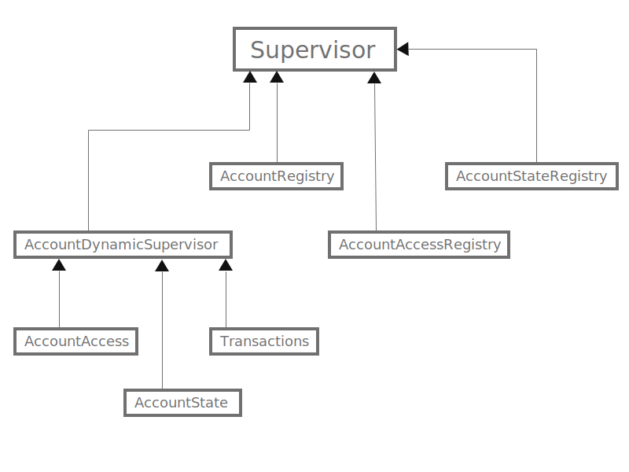

# ExBanking Made By | [Anthony Gonzalez](https://elixirprogrammer.com "elixirprogrammer.com")

Banking application made with Elixir/OTP with the following functionality:

- Users can be created in the system with a string, a user will be a process in the system created with a registry, and a backup process to maintain the state when process interrupted or restarted.

- Users can deposit money for any currency.

- Users can withdraw money from any currency.

- Users can get balance from any currency, balance will belong to a currency.

- Users can send money from account to other users.

### Installation and running this solution

#### Project Operating System Dependencies Requirements

This solution was made with Elixir, to run locally the following is needed:

* Elixir 1.13 or later
* Erlang 22 or later

Fetch dependencies:

```sh
mix deps.get
```

To run the test:

```sh
mix test
```

### Modules

** ExBanking **

Main public interface.

** AccountAccess **

Genserver to control access with rate limit to transactions.

** Account **

For account creation.

** AccountState **

To keep account state when process gets restarted.

** AccountDynamicSupervisor **

Dynamic supervisor to start account workers.

** Transactions **

To handle all users transactions.

### Supervision Tree View


<!-- 
### See modules inside after generate the docs using

